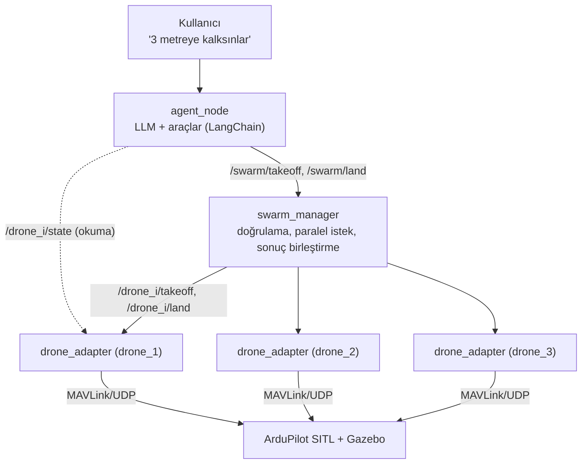

# SwarmWithAgent: LLM ile Sürü Drone Yönetimi

Gazebo'da çalışan ArduPilot drone sürüsünü doğal dil komutlarıyla yöneten bir ROS 2 projesi. Kullanıcı "3 metreye kalksınlar" der; bir LLM bu cümleyi uygun aracın çağrısına çevirir; araçlar ROS 2 servisleri üzerinden sürüyü hareket ettirir.

LLM burada yalnızca **araç çağırıcı**: neyin çağrılacağına karar verir, ama parametre doğrulaması ve güvenlik kontrolleri ROS 2 tarafında yapılır. İlke: **model önerir, sistem doğrular.**

## Mimari



Her katman yalnızca bir altındakini tanır: agent drone'ların nasıl uçtuğunu bilmez, manager LLM'den habersizdir, adaptörler sürüyü bilmez. Simülasyona özgü kontrol dili (MAVLink, NED, lat/lon) yalnızca adaptör katmanında kalır; gerçek drone'lara geçişte üst katmanlar değişmez.

| Bileşen | Görevi |
|---|---|
| `mavlink_link.py` | pymavlink ile bağlantı; komutları `COMMAND_ACK` ile doğrular, telemetriyi okur, heartbeat ile bağlantı kopukluğunu algılar. ROS'tan bağımsızdır. |
| `frames.py` | GPS (lat/lon/alt) ↔ ortak yerel çerçeve (ENU, metre) ve NED ↔ ENU dönüşümleri. ROS'tan bağımsızdır. |
| `drone_adapter.py` | Her drone için bir örnek. Durumu yayınlar, takeoff/land servislerini ve setpoint topic'ini sunar. |
| `swarm_manager.py` | Sürü servisleri. İrtifa sınırlarını doğrular, istekleri tüm drone'lara paralel gönderir, sonuçları birleştirir. |
| `agent_node.py` | LLM'i (Gemini) ROS servislerine bağlayan araçlar ve konuşma döngüsü. |

## Gereksinimler

- Ubuntu 22.04
- ROS 2 Humble
- Gazebo + ArduPilot SITL (`ardupilot_gz`) ile çoklu drone simülasyonu
- Python 3.10 (ROS 2 Humble'ın sistem Python'u)
- Bir Google Gemini API anahtarı

## Kurulum

```bash
# 1. Depoyu klonla
git clone <repo-url>
cd SwarmWithAgent

# 2. Python bağımlılıkları (ROS'un kullandığı Python 3.10'a kurulmalı)
pip install pymavlink pyyaml python-dotenv \
    langchain langchain-google-genai langgraph langgraph-checkpoint-sqlite

# 3. Derle
source /opt/ros/humble/setup.bash
colcon build --symlink-install
source install/setup.bash
```

`swarm_talk_interfaces` paketi değiştiğinde (yeni `.msg`/`.srv`) ya da `setup.py` güncellendiğinde yeniden derlemek gerekir. Python kodundaki değişiklikler `--symlink-install` sayesinde derleme gerektirmez.

## Yapılandırma

### `src/swarm_talk/config/drones.yaml`

```yaml
num_drones: 3
base_port: 14550        # drone_1'in MAVLink UDP portu; her drone 10 artar
ip_address: 127.0.0.1
ref_lat: -35.3632621    # sürü çerçevesinin orijini (drone_1'in yerdeki konumu)
ref_lon: 149.1652814
ref_alt: 584.14         # yerdeki irtifa (deniz seviyesine göre, m)
```

Launch dosyası bu değerlerden her drone için bir adaptörü `/drone_<id>` namespace'iyle başlatır. Portlar `base_port + 10 * (id - 1)` kuralıyla atanır.

**Referans noktası** tüm drone'lar için ortak olmalıdır. Simülasyonun home konumu değişirse, drone_1 yerdeyken okunan lat/lon/alt değerleriyle güncelleyin. ENU çerçevesinde `x` doğu, `y` kuzey, `z` yerden yüksekliktir.

### API anahtarı

```bash
export GOOGLE_API_KEY="anahtarınız"
```

Alternatif olarak agent'ı çalıştırdığınız dizine bir `.env` dosyası koyabilirsiniz. `.env` dosyası `.gitignore`'dadır; **asla commit etmeyin.**

## Çalıştırma

Üç ayrı terminal gerekir. Her birinde önce `source install/setup.bash`.

```bash
# Terminal 1: simülasyon (Gazebo + 3 ArduPilot SITL)
<simülasyon launch komutu>

# Terminal 2: adaptörler + sürü yöneticisi
ros2 launch swarm_talk swarm.launch.py

# Terminal 3: agent (klavyeden girdi aldığı için launch'a eklenmez)
ros2 run swarm_talk agent_node
```

Örnek komutlar:

```
> 3 metreye kalksınlar
> drone'lar ne durumda?
> 100 metreye çıksınlar      # reddedilir: izin verilen aralık 1-30 m
> inin
```

## LLM olmadan test

Sistemin geri kalanı agent'tan bağımsız olarak terminalden test edilebilir. Bir sorun çıktığında hatanın LLM'de mi yoksa sistemde mi olduğunu ayırmanın en hızlı yolu budur.

```bash
# Sürü kalkışı
ros2 service call /swarm/takeoff swarm_talk_interfaces/srv/Takeoff "{altitude: 5.0}"

# Doğrulama testi: drone'lar kıpırdamamalı
ros2 service call /swarm/takeoff swarm_talk_interfaces/srv/Takeoff "{altitude: 100.0}"

# Sürü inişi
ros2 service call /swarm/land std_srvs/srv/Trigger

# Bir drone'un durumu
ros2 topic echo /drone_1/state
```

## ROS 2 arayüzleri

| Ad | Tür | Tip | Açıklama |
|---|---|---|---|
| `/swarm/takeoff` | servis | `swarm_talk_interfaces/srv/Takeoff` | Tüm sürüyü kaldırır; irtifayı doğrular |
| `/swarm/land` | servis | `std_srvs/srv/Trigger` | Tüm sürüyü indirir |
| `/drone_<id>/takeoff` | servis | `swarm_talk_interfaces/srv/Takeoff` | Tek drone: GUIDED → arm → takeoff |
| `/drone_<id>/land` | servis | `std_srvs/srv/Trigger` | Tek drone inişi |
| `/drone_<id>/state` | topic | `swarm_talk_interfaces/msg/DronState` | Konum ve hız (ENU), yaw, mod, arm, bağlantı |
| `/drone_<id>/setpoint` | topic | `swarm_talk_interfaces/msg/Setpoint` | ENU konum hedefi |

Agent yalnızca `/swarm/*` servislerini çağırır ve `/drone_<id>/state` topic'lerini okur; drone'lara doğrudan komut vermez.

## Proje yapısı

```
SwarmWithAgent/
└── src/
    ├── swarm_talk/
    │   ├── config/drones.yaml
    │   ├── launch/swarm.launch.py
    │   └── swarm_talk/
    │       ├── agent_node.py
    │       ├── drone_adapter.py
    │       ├── frames.py
    │       ├── mavlink_link.py
    │       └── swarm_manager.py
    └── swarm_talk_interfaces/
        ├── msg/   DronState.msg, Setpoint.msg
        └── srv/   Takeoff.srv
```

## Bilinen sınırlamalar

- Yalnızca simülasyonda test edildi.
- Formasyon desteği henüz yok.
- Tekil drone komutları agent'a açık değil.
- Sürü kalkışında bir drone başarısız olursa diğerleri otomatik olarak indirilmiyor; sonuç yalnızca raporlanıyor.
- `link_ok` durumu yayınlanıyor ama henüz otomatik bir güvenlik tepkisine bağlı değil.
- Küçük yerel modeller (ör. Llama 3.2 3B) araç uydurabiliyor ve çağrı formatını bozabiliyor; bu nedenle şu an Gemini kullanılıyor.

## Yol haritası

- [ ] Formasyonlar (`line`, `triangle`, `circle`): slot üretimi, Macar algoritmasıyla atama, servis ve agent aracı
- [ ] Kalkış başarısızlığında geri alma (diğer drone'ları indirme)
- [ ] Bağlantı kopmasına otomatik tepki
- [ ] Bileşik komutlar ("kalkın ve üçgen olun")
- [ ] Bulut ve yerel modellerin araç çağırma başarımının karşılaştırılması
